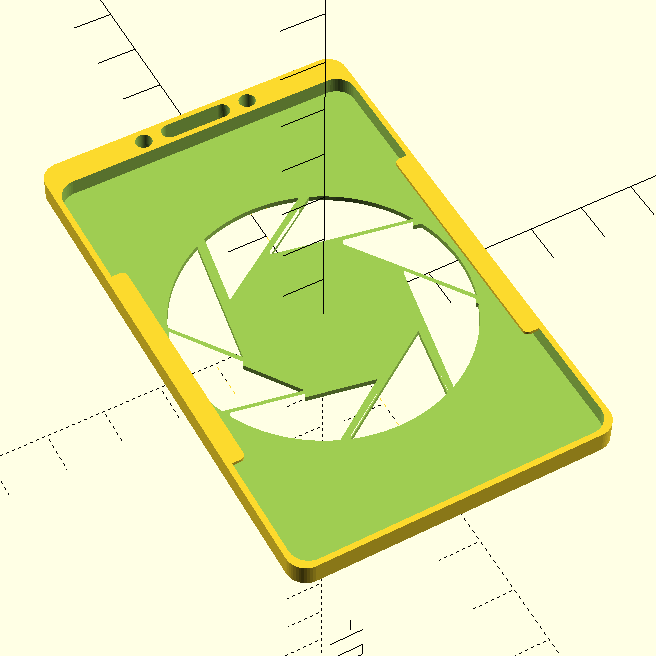
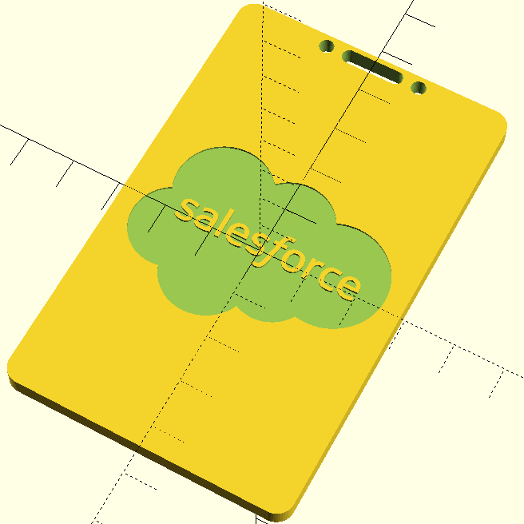

# openscad Card Holder

Make a card holder, with your own custom logo!

## Top Tips

1. Can't see your SVG? Adjust `svgScale` down to make sure your SVG fits into the back of the card holder.
2. Don't need a logo? Turn `svgEnable` to false.
3. Does your logo leave islands? Disable `svgShouldPenetrate` to ensure you are only embossing, and not penetrating.

## Examples

## Licence

- `cardholder.scad` is licenced under the MIT licence.
- Other files do not have a licence, as they are trademarks and logos of Salesforce and Valve Software
